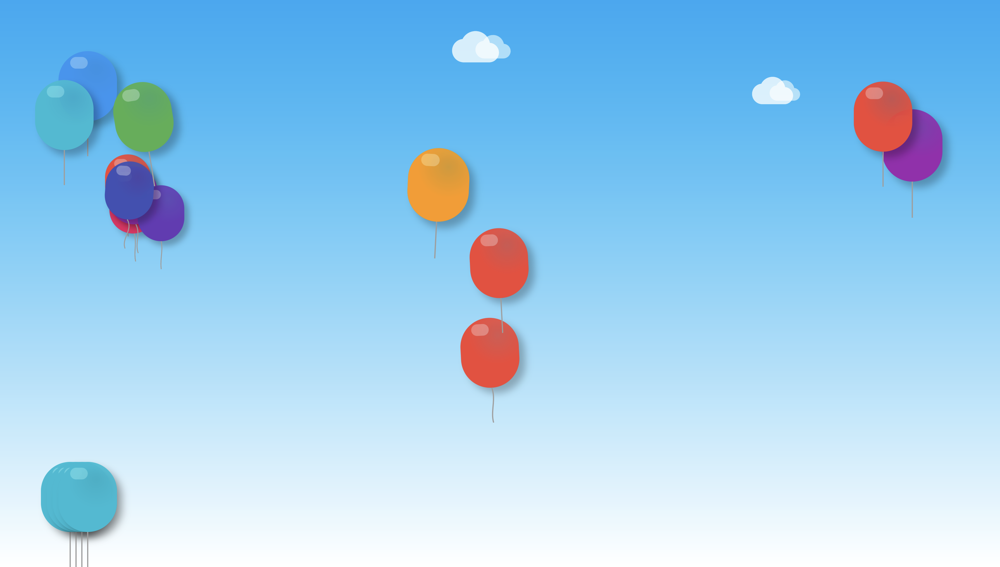

# Flutter Balloon Animation Screen

This project showcases a dynamic balloon animation scene built with Flutter. The app includes various animated effects such as easing, rotation, pulsing, background animation, textures, and user interactions for an immersive experience. The balloons have realistic shadows, textures, and even sound effects to enhance the experience.

 <!-- Update the path if necessary -->

## Features

1. **Easing and Curve Improvements**: The balloon animations use different easing curves to create a more natural movement effect.
2. **Balloon Shadow**: Each balloon has a subtle shadow to create a 3D effect.
3. **Rotation Animation**: Balloons gently rotate as they rise, emulating a drifting motion.
4. **Pulse Animation**: Balloons slightly increase and decrease in size, giving a pulsing effect for a more lively look.
5. **Background Animation**: Clouds or birds move across the background, adding depth to the scene.
6. **Balloon Texture**: Each balloon uses a textured or gradient appearance instead of plain colors for a realistic look.
7. **Interaction**: Users can drag and resize the balloons, adding an interactive element to the experience.
8. **Sound Effects**: Sound effects such as gentle inflation and wind sounds play during the animations.
9. **Sequential Animations**: Balloons can follow a sequence of animations. For example, after reaching the top, they might burst or float away.
10. **Multiple Balloons**: Multiple balloons with slightly varied animations add a dynamic and playful aspect to the screen.

## Preview

To see the balloon animation in action, run the app on an Android or iOS simulator. Below is a screenshot preview of the app interface:


## Setup Instructions

1. **Clone the repository**:
   ```bash
   git clone https://github.com/SamnangGit/flutter-midterm-balloon.git

   cd flutter-midterm-balloon
   ```

2. **Install dependencies**:
    ```
    flutter pub get
    ```

3. **Run the app**:
    ```
    flutter run
    ```


## Code Structure

- AnimatedBalloonScreen.dart: The main screen implementing the balloon animations and interactions.

### Components:
- EasingBalloon: Balloon with easing and curve effects.
- ShadowBalloon: Adds shadow for a realistic effect.
- RotatingBalloon: Balloon rotates as it floats up.
- PulsingBalloon: Subtle pulsing animation.
- AnimatedBackground: Adds background animations like clouds or birds.
- TexturedBalloon: Balloon with gradient/texture.
- InteractiveBalloon: Allows user interactions with the balloon.
- SoundController: Controls sound effects.
- SequentialBalloon: Implements sequential animations, like bursting or floating away.
- MultipleBalloons: Introduces multiple balloons with slight animation variations.

### Utils:
- BalloonUtils: Provides reusable functions for creating balloons with custom properties such as color, scale, string, and wind effect.

### Config:
- AnimationConstants: Contains constant values for animation durations, sizes, scaling, and color opacities to standardize animation behaviors across components.


## Dependencies

- Flutter SDK
- Additional packages for sound and animation:
        flutter_sound: for sound effects
        flutter_animate: for advanced animations

## Animation Details

- Each animation component utilizes Flutter's AnimationController and CurvedAnimation for smooth transitions. Constants from AnimationConstants standardize durations, sizes, and scale for a consistent animation experience. The BalloonUtils class simplifies balloon generation, and it includes reusable properties for color, scale, and shadow effects. The wind effect creates a gentle swaying motion in the balloon string.